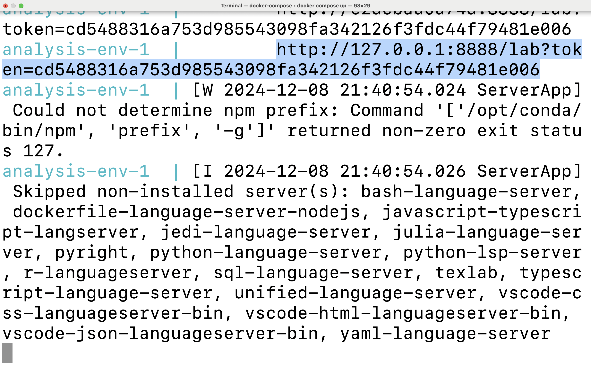

# AI's representation bias about livestock farming

This project explores the representation bias about livestock farming in text-to-image generative AI models (DALL-E 3 and Stable Diffusion 3.5-large).

## Dataset Information

- **Title of Dataset:** Replication Data for: AI's representation bias about livestock farming
- **Paper DOI:**
- **Dataset DOI:**
- **Dataset Created:** 2024-10-01
- **Created by:** Kehan (Sky) Sheng
- **Contact Email:** <skysheng7@gmail.com>

## Contributors

- **Principal Investigator:** Marina von Keyserlingk  
  - ORCID: 0000-0002-1427-3152  
  - Affiliation: University of British Columbia  
  - Email: <nina@mail.ubc.ca>

- **Contributor:** Kehan Sheng  
  - ORCID: 0000-0001-6442-5284  
  - Affiliation: University of British Columbia  
  - Email: <skysheng7@gmail.com>

- **Contributor:** Frank Tuyttens
  - ORCID: 0000-0001-6442-5284
  - Affiliation_1: Fisheries and Food (ILVO)
  - Affiliation_2: Ghent University
  - Email: <frank.tuyttens@ilvo.vlaanderen.be>

## Dependencies

- [Docker](https://docs.docker.com/get-started/)

## Usage Guide

### Initial Setup

> Important: For Windows and Mac users, ensure [Docker Desktop](https://docs.docker.com/get-started/) is actively running before proceeding.

1. First, obtain a copy of this GitHub repository on your local machine.

- Open your terminal or command prompt and navigate to your preferred project directory using the `cd` command. Then execute these commands:

    ```bash
    git clone https://github.com/skysheng7/AI_bias_in_farming.git
    cd AI_bias_in_farming
    ```

- New to git and GitHub? Please follow the official [setup guide](https://docs.github.com/en/get-started/getting-started-with-git/set-up-git) to get started.

### Starting the Analysis

1. In your terminal, ensure you're in the project's root directory, then launch the Docker container:

```
docker compose up
```

2. Watch your terminal output for a unique URL beginning with
`http://127.0.0.1:8888/lab?token=`.
You'll see it displayed as highlighted in the example screenshot below.
Copy this URL and open it in your web browser to access the Jupyter Lab interface.



3. In Jupyter Lab, you'll find all analysis notebooks in the "notebooks" directory on the left sidebar.
Double-click any notebook to begin exploring the analysis.

4. To run text-to-image or image-to-text models yourself, you'll need to set up API authentication:

- Create a file named `.env` in the project's root directory
- Add your API keys to this file in the following format:

    ```
    OPENAI_API_KEY=your_openai_key_here
    stable_diffusion_key=your_stability_key_here
    ```

- To obtain API keys:
  - For OpenAI (DALL-E 3): Follow the [OpenAI API setup guide](https://platform.openai.com/docs/quickstart)
  - For Stable Diffusion: Register and get your key from the [Stability AI platform](https://platform.stability.ai/docs/getting-started)

Note: The `.env` file contains sensitive information and is automatically ignored by git (listed in .gitignore) to protect your API keys.

### Project Cleanup

1. When you're finished, properly shut down the container and remove associated resources:
Press `Cntrl` + `C` in your terminal where the container is running, then execute `docker compose rm`

## Developer notes

### Developer dependencies

- `conda` (>= 24.11.0)
- `conda-lock` (>= 2.5.7)

## Collaboration Welcome

If you find this research valuable or interesting, please consider:

- Starring this repository to help others discover this work
- Creating a fork if you'd like to build upon or extend this research
- Opening issues or pull requests if you have suggestions for improvements

Your engagement helps advance our understanding of AI bias in agricultural contexts.

## Copyright

- Copyright © 2024 Kehan (Sky) Sheng.
- Free software distributed under the [MIT License](./LICENSE).
- Report and documentation generated in this project are distributed under the [CC BY 4.0](./LICENSE).
