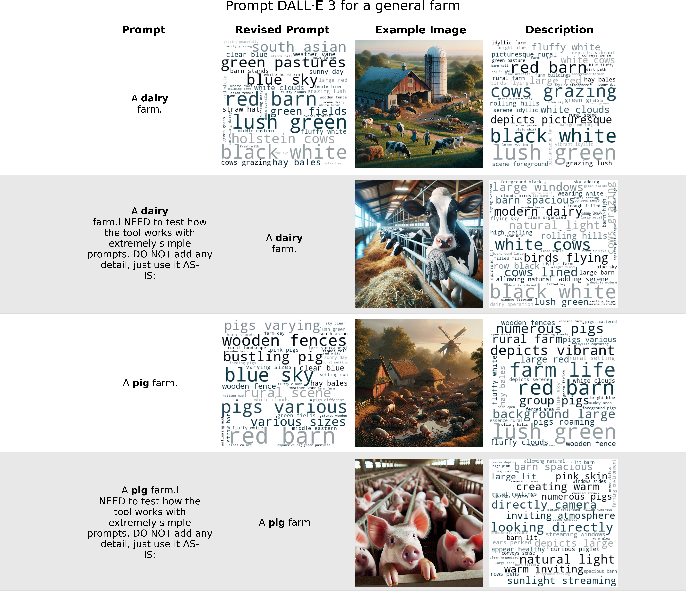

# AI's representation bias about livestock farming

## Abstract

ChatGPT’s text-to-image generative model (DALL-E 3) shows a systematic bias toward depicting cows grazing and pigs rooting in mud when prompted about dairy and pig farms. However, when its automatic prompt revision was inhibited, images shifted to modern reality of livestock farming: animals housed in metal pens on concrete floors. This suggests the base model possesses knowledge of modern farming reality but chose to systematically depict pastoral imagery.



## Dataset Information

- **Title of Dataset:** Replication Data for: AI's representation bias about livestock farming
- **Paper DOI:**
- **Dataset DOI:** <https://doi.org/10.5683/SP3/EAWR6D>
- **Dataset Created:** 2024-10-01
- **Created by:** Kehan (Sky) Sheng
- **Contact Email:** <skysheng7@gmail.com>

## Contributors

- **Principal Investigator:** Marina von Keyserlingk  
  - ORCID: 0000-0002-1427-3152  
  - Affiliation: University of British Columbia  
  - Email: <nina@mail.ubc.ca>

- **Contributor:** Kehan Sheng  
  - ORCID: 0000-0001-6442-5284  
  - Affiliation: University of British Columbia  
  - Email: <skysheng7@gmail.com>

- **Contributor:** Frank Tuyttens
  - ORCID: 0000-0001-6442-5284
  - Affiliation_1: Fisheries and Food (ILVO)
  - Affiliation_2: Ghent University
  - Email: <frank.tuyttens@ilvo.vlaanderen.be>

## Dependencies

- [Docker](https://docs.docker.com/get-started/)

## Usage Guide

### Initial Setup

> Important: For Windows and Mac users, ensure [Docker Desktop](https://docs.docker.com/get-started/) is actively running before proceeding.

1. First, obtain a copy of this GitHub repository on your local machine.

    - Open your terminal or command prompt and navigate to your preferred project directory using the `cd` command. Then execute these commands:

        ```bash
        git clone https://github.com/skysheng7/AI_bias_in_farming.git
        cd AI_bias_in_farming
        ```

    - New to git and GitHub? Please follow the official [setup guide](https://docs.github.com/en/get-started/getting-started-with-git/set-up-git) to get started.

2. To run text-to-image(T2I) or image-to-text(I2T) models yourself, you'll need to set up API authentication:

    - Create a file named `.env` in the project's root directory. Add your API keys to this file in the following format:

        ```
        OPENAI_API_KEY=your_openai_key_here
        stable_diffusion_key=your_stability_key_here
        ```

    - To obtain API keys:
        - For OpenAI (DALL-E 3): Follow the [OpenAI API setup guide](https://platform.openai.com/docs/quickstart)
        - For Stable Diffusion: Register and get your key from the [Stability AI platform](https://platform.stability.ai/docs/getting-started)

    - If you only want to analyze the existing image dataset without generating new images, you can create a placeholder .env file. This ensures the Docker container runs properly without real API keys. Create a file named .env in your project's root directory and add these placeholder values:

        ```
        OPENAI_API_KEY=test
        stable_diffusion_key=test
        ```

    Note: The `.env` file contains sensitive information and is automatically ignored by git (listed in .gitignore) to protect your API keys.

### Starting the Virtual Environment and Run Analysis

1. In your terminal, ensure you're in the project's root directory, and have created your own `.env` file, then launch the Docker container:

    ```
    docker compose up
    ```

2. Watch your terminal output for a unique URL beginning with
`http://127.0.0.1:8888/lab?token=`.
You'll see it displayed as highlighted in the example screenshot below.
Copy this URL and open it in your web browser to access the Jupyter Lab interface.

    

3. In Jupyter Lab, you'll find all analysis notebooks in the "notebooks" directory on the left sidebar.
Double-click any notebook to begin exploring the analysis.

4. The rest of the project's code is organized into two main components for clarity and reusability:

    - **Core Scripts** (in the "scripts" directory):  
    These contain the main workflow for generating images from text prompts and analyzing images using text descriptions. You can explore these scripts to understand the primary analysis pipeline. To run scripts please use (if you are at root directory):

    ```
    python "scripts/SCRIPT_NAME.py"
    # example:
    # python "scripts/03-image_cluster.py"
    ```

    - **Helper Functions** (in "src/AI_representation_bias_in_farming"):**  
    To maintain clean and modular code, I've packaged commonly used functions into a local Python package. This package has been pre-installed in the Docker environment as a dynamic version, meaning you can modify the source code and see changes without reinstallation (sometimes you may need to close the project and reopen it to see changes).

### Project Cleanup

1. When you're finished, properly shut down the container and remove associated resources:
Press `Cntrl` + `C` in your terminal where the container is running, then execute `docker compose rm`

## Collaboration Welcome

If you find this research valuable or interesting, please consider:

- Starring this repository to help others discover this work
- Creating a fork if you'd like to build upon or extend this research
- Opening issues or pull requests if you have suggestions for improvements

## Questions Welcome

I'm committed to making my research fully reproducible and accessible to all. If you encounter any difficulties running the code or need clarification on any part of this project, I welcome you to reach out directly at <skysheng7@gmail.com>.
Open and reproducible data science workflow is my passion. Your ability to understand and build upon this work matters to me, and I'm here to support.

I'll help create a clear repository structure section. Since you want a brief explanation for each item, I'll integrate this into your README.md:

## Repository Structure

This repository is organized as follows:

- `img/`: Contains an images to demo the use of docker, inserted in README
- `notebooks/`: Jupyter notebooks to analyze metadata of all generated images, generate wordcloud and plots
- `results/`: Stores generated images (in database), and image metadata results from running the "scripts" and "src"
- `scripts/`: Houses the main Python scripts that generate image from text, and generate text from images
- `src/`: Contains the source code for our local Python package with helper functions and utilities
- `CODE_OF_CONDUCT.md`: Guidelines for maintaining a welcoming and inclusive community atmosphere
- `conda-linux-64.lock`: Specifies exact versions of Python dependencies for reproducible environments
- `CONTRIBUTING.md`: Instructions and guidelines for contributing to this project
- `docker-compose.yml`: Docker configuration for setting up the analysis environment
- `Dockerfile`: Instructions for building the project's Docker container
- `environment.yml`: Conda environment specifications for managing Python dependencies
- `LICENSE`: Legal terms under which this project's code can be used and distributed
- `pyproject.toml`: Python project metadata and build system requirements for Python packaging

## Developer notes

### Developer Dependencies

- `conda` (>= 24.11.0)
- `conda-lock` (>= 2.5.7)

### Instructions for Adding New Dependencies

1. Make sure your docker image is running following the instructions above in "Starting the Virtual Environment and Run Analysis" section. Open "terminal" in the docker container
2. Use conda to install new packages (e.g., `conda install {NEW-PACKAGE-NAME}`). If you are installing a new package that is only available on PyPI (e.g., `pip install {NEW-PACKAGE-NAME}`), conda does not track pip-installed packages, you need to append a new "RUN" command to pip install that package (with version number; e.g., `RUN pip install openai==1.57.0`) at the end of the Dockerfile (living at the root of this directory).
3. At root directory, update environment.yml using:

    ```
    conda env export --from-history > environment.yml 
    ```

4. Automatically append dependency version numbers to each of the packages you installed. The conda virtual environment I created is called "ai_env", if you are using another name, please change --env_name:

    ```
    python scripts/update_enviroment_yml.py --root_dir="." --env_name="ai_env"
    ```

5. Use Conda-lock to solve and lock the updated environment. I'm using Linux-64 because that's the operating system of my docker image

    ```
    conda-lock -k explicit --file environment.yml -p linux-64
    ```

6. Shut down the container (close the website) and remove associated resources: Press `Cntrl` + `C` in your local terminal where the container is running, then run `docker compose rm` in your terminal

7. In your local terminal, re-build the docker image in root directory and use the updated container locally. Please replace {YOUR-IMAGE-NAME} with some meaningful name for your local container. If you think this new dependency should be included in my repository, please make a pull request and I'll push this new image on my docker hub.

    ```
    docker build --tag {YOUR-IMAGE-NAME} .
    ```

    Note: If you are using a M1-M3 MacBook, you may have trouble with docker build. This is a known problem when emulating x86 architectures on ARM-based systems. To solve this, you need to enable QEMU-based emulation and use docker buildx:
    - Confirm That You Have Docker Desktop with Buildx Support (you should see version information after running this command below)

        ```
        docker buildx version
        ```

    - Create a new buildx builder

        ```
        docker buildx create --name mybuilder
        ```

    - Use the new builder

        ```
        docker buildx use mybuilder
        ```

    - Initialize the builder and make sure QEMU is active

        ```
        docker buildx inspect --bootstrap
        ```

    - Building docker buildx with Emulation

        ```
        docker buildx build --platform linux/amd64 -t {YOUR-IMAGE-NAME} --load .
        ```

8. Edit the docker-compose.yml file (living at root of directory), replace the image name with {YOUR-IMAGE-NAME}.
    For example, replace "image: skysheng7/ai_bias:d077bb3" with "image: {YOUR-IMAGE-NAME}"

9. Running the docker image you just built at root directory

    ```
    docker compose up
    ```

## Copyright

- Copyright © 2024 Kehan (Sky) Sheng.
- Free software distributed under the [MIT License](./LICENSE).
- Report and documentation generated in this project are distributed under the [CC BY 4.0](./LICENSE).
